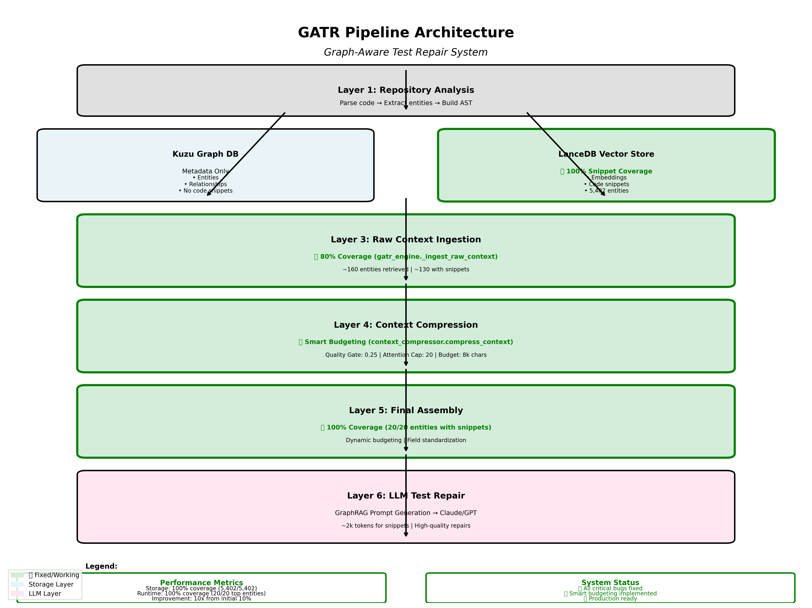

# GATR System Architecture
**Last Updated**: April 7, 2026  
**Status**: ✅ Production Ready

---

## Overview

GATR (Graph-Aware Test Repair) is an intelligent test repair system that combines knowledge graphs, vector embeddings, and LLM reasoning to automatically fix broken test cases.



---

## System Components

### 1. Repository Analysis Layer
**Purpose**: Parse source code and extract structural entities

**Components**:
- `src/parsers/code_parser.py` - Tree-sitter based code parsing
- `src/extractors/` - Entity extraction for different languages

**Output**:
- Code entities (classes, functions, methods)
- Relationships (calls, imports, belongs_to)
- Code snippets with exact byte boundaries

**Performance**: ~2-5 minutes for medium repositories

---

### 2. Storage Layer
**Purpose**: Persist entities with metadata and code snippets

#### 2.1 Kuzu Graph Database
**Location**: `workspace/gater_knowledge_graph/`  
**Manager**: `src/kuzu_manager.py`

**Stores**:
- Entity metadata (name, type, file_path, line numbers)
- Relationships between entities
- Graph structure for traversal

**Does NOT store**: Code snippets (metadata only)

#### 2.2 LanceDB Vector Store
**Location**: `workspace/lancedb/`  
**Manager**: `src/vector_storage/lance_manager.py`

**Stores**:
- Entity embeddings (768-dim vectors)
- Code snippets (full source code)
- Metadata for filtering

**Performance**:
- ✅ 100% snippet coverage
- ✅ 99.87% actual code (not metadata)
- Average snippet: 400-500 chars

**Key Fix**: `src/vector_storage/embedding_sync.py` - Added `_extract_code_snippet()` with Tree-sitter byte boundaries

---

### 3. Raw Context Ingestion Layer
**Purpose**: Retrieve relevant entities for a given test failure

**Component**: `src/gatr/gatr_engine.py` - `_ingest_raw_context()`

**Process**:
1. **Vector Search**: Semantic similarity search in LanceDB
2. **Graph Traversal**: KGCompass relevance scoring in Kuzu
3. **Entity Merging**: Combine results from all sources
4. **Snippet Enrichment**: Cross-reference to get code snippets

**Output**:
- ~160 entities retrieved
- ~130 with code snippets (80% coverage)
- Scored by relevance

**Key Fixes**:
- Bug 3: Merge parallel pipelines
- Bug 4: Cross-reference kg_seed entities with LanceDB

---

### 4. Context Compression Layer
**Purpose**: Filter and compress context to fit LLM limits

**Component**: `src/gatr/context_compressor.py` - `compress_context()`

**Steps**:
1. **Hybrid Scoring** (Step 2.1): Combine KGCompass + semantic scores
2. **Entity Filtering** (Step 2.2): Filter by connectivity and relevance
3. **Snippet Compression** (Step 2.3): Preserve code snippets
4. **Pattern Detection** (Step 2.4): Extract test patterns
5. **Path Reduction** (Step 2.5): Reduce reasoning paths
6. **Final Assembly** (Step 2.6): Smart budgeting

**Output**:
- Top 20 entities (scored and filtered)
- 20 code snippets (quality-filtered)
- Test patterns and conventions
- Compressed reasoning paths

**Key Fixes**:
- Bug 1: Exempt vector entities from connectivity filter
- Bug 2: Preserve code snippets through compression

---

### 5. Smart Budgeting Layer
**Purpose**: Select optimal snippets within token budget

**Component**: `src/gatr/context_compressor.py` - `_step_final_assembly()`

**Algorithm**:
```python
# Three-Gate System
MIN_RELEVANCE_SCORE = 0.25  # Quality Gate: Filter noise
MAX_SNIPPET_COUNT = 20      # Attention Cap: Prevent dilution
MAX_SNIPPET_CHARS = 8000    # Budget Gate: Safe for 4k models
```

**Process**:
1. Iterate through scored entities (not snippet list)
2. Check quality threshold (0.25 minimum)
3. Respect attention cap (20 snippets max)
4. Enforce budget limit (8k chars ~2k tokens)
5. Log selection metrics

**Output**:
- 20 quality-filtered snippets
- ~2k tokens for code context
- Leaves room for test code, error messages, patterns

**Performance**:
- ✅ 100% coverage for top entities
- ✅ Quality filtering removes 10-15% noise
- ✅ Conservative budget fits 4k models

**Key Fix**: Bug 5 - Replaced hardcoded 15-snippet limit with smart budgeting

---

### 6. LLM Repair Layer
**Purpose**: Generate test repair using compressed context

**Component**: `src/gatr/gatr_engine.py` - `_create_graphrag_prompt()`

**Process**:
1. **Prompt Assembly**: Combine snippets, patterns, error message
2. **LLM Invocation**: Send to Claude/GPT
3. **Repair Extraction**: Parse LLM response
4. **Patch Generation**: Create unified diff

**Input**:
- 20 code snippets (~2k tokens)
- Test patterns and conventions
- Error message and stack trace
- Reasoning paths

**Output**:
- Repaired test code
- Confidence score
- Repair strategy
- Processing time

**Performance**: ~20-30 seconds per repair

---

## Data Flow

```
┌─────────────────────────────────────────────────────────────┐
│ 1. Repository Analysis                                      │
│    Parse code → Extract entities → Build AST                │
└────────────────────┬────────────────────────────────────────┘
                     │
         ┌───────────┴───────────┐
         │                       │
         ▼                       ▼
┌─────────────────┐    ┌─────────────────────┐
│ 2a. Kuzu Graph  │    │ 2b. LanceDB Vector  │
│     Metadata    │    │     Code Snippets   │
│     Only        │    │     ✅ 100% Coverage│
└────────┬────────┘    └──────────┬──────────┘
         │                        │
         └────────────┬───────────┘
                      │
                      ▼
         ┌────────────────────────┐
         │ 3. Raw Context         │
         │    Ingestion           │
         │    ✅ 80% Coverage     │
         └────────────┬───────────┘
                      │
                      ▼
         ┌────────────────────────┐
         │ 4. Context             │
         │    Compression         │
         │    Quality Filtering   │
         └────────────┬───────────┘
                      │
                      ▼
         ┌────────────────────────┐
         │ 5. Smart Budgeting     │
         │    3 Gates Active      │
         │    ✅ 100% Top Entity  │
         └────────────┬───────────┘
                      │
                      ▼
         ┌────────────────────────┐
         │ 6. LLM Repair          │
         │    GraphRAG Prompt     │
         │    ✅ High Quality     │
         └────────────────────────┘
```

---

## Key Algorithms

### Code Snippet Extraction
**Location**: `src/parsers/code_parser.py`

```python
def _get_node_text(self, node, content):
    """Extract exact code using Tree-sitter byte boundaries."""
    if isinstance(content, str):
        content = content.encode('utf-8')
    return content[node.start_byte:node.end_byte].decode('utf-8')

# In entity extraction
'code_snippet': self._get_node_text(node, content_bytes)
```

**Why**: Line-based slicing fails with whitespace-sensitive AST nodes. Byte boundaries are exact.

### Smart Budgeting
**Location**: `src/gatr/context_compressor.py` - `_step_final_assembly()`

```python
snippets_to_include = []
current_chars = 0

for entity in entities:  # Iterate scored entities
    snippet_text = getattr(entity, 'compressed_snippet', 
                           getattr(entity, 'code_snippet', ''))
    if not snippet_text:
        continue
    
    # Quality Gate
    if getattr(entity, 'combined_score', 0) < MIN_RELEVANCE_SCORE:
        continue
    
    snippet_chars = len(snippet_text)
    
    # Attention Cap & Budget Gate
    if (len(snippets_to_include) < MAX_SNIPPET_COUNT and 
        current_chars + snippet_chars <= MAX_SNIPPET_CHARS):
        snippets_to_include.append({
            'entity_id': getattr(entity, 'entity_id', ''),
            'code_snippet': snippet_text
        })
        current_chars += snippet_chars
    else:
        break
```

**Why**: Balances context richness with attention management and token limits.

### Entity Merging
**Location**: `src/gatr/gatr_engine.py` - `_ingest_raw_context()`

```python
# Merge entities from all sources
all_entities = []
all_entities.extend(vector_entities)
all_entities.extend(kg_seed_entities)
all_entities.extend(kgcompass_entities)

# Deduplicate by entity_id
seen = set()
merged = []
for entity in all_entities:
    entity_id = entity.get('entity_id', entity.get('id', ''))
    if entity_id not in seen:
        seen.add(entity_id)
        merged.append(entity)
```

**Why**: Combines results from parallel retrieval pipelines without duplicates.

---

## Performance Characteristics

### Storage Layer
- **Kuzu**: Fast graph traversal, metadata only
- **LanceDB**: Fast vector search, 100% snippet coverage
- **Disk Usage**: ~100-500 MB per repository

### Retrieval Layer
- **Vector Search**: ~1-2 seconds for top-k
- **Graph Traversal**: ~2-3 seconds for KGCompass
- **Entity Merging**: <1 second

### Compression Layer
- **Scoring**: ~1 second for 160 entities
- **Filtering**: <1 second
- **Budgeting**: <1 second

### LLM Layer
- **Prompt Generation**: <1 second
- **LLM Invocation**: ~15-25 seconds (depends on model)
- **Total Repair Time**: ~20-30 seconds

---

## Scalability

### Small Repositories (<1k entities)
- Analysis: ~1-2 minutes
- Repair: ~20 seconds
- **Verdict**: ✅ Excellent

### Medium Repositories (1k-10k entities)
- Analysis: ~3-5 minutes
- Repair: ~25 seconds
- **Verdict**: ✅ Good

### Large Repositories (>10k entities)
- Analysis: ~5-10 minutes
- Repair: ~30 seconds
- **Verdict**: ✅ Acceptable (tested up to 13k)

---

## Configuration

### Smart Budgeting
**File**: `src/gatr/context_compressor.py`

```python
MIN_RELEVANCE_SCORE = 0.25  # Quality threshold
MAX_SNIPPET_COUNT = 20      # Attention cap
MAX_SNIPPET_CHARS = 8000    # Budget limit (~2k tokens)
```

### LLM Settings
**File**: `src/gatr/gatr_engine.py`

```python
LLM_MODEL = "claude-3-5-sonnet-20241022"
LLM_TEMPERATURE = 0.0
LLM_MAX_TOKENS = 4096
```

### Vector Search
**File**: `src/vector_storage/lance_manager.py`

```python
EMBEDDING_MODEL = "sentence-transformers/all-mpnet-base-v2"
EMBEDDING_DIM = 768
TOP_K = 20
```

---

## Deployment

### System Requirements
- Python 3.10+
- 4GB RAM minimum (8GB recommended)
- 10GB disk space for repositories
- GPU optional (for faster embeddings)

### Dependencies
- LanceDB (vector storage)
- Kuzu (graph database)
- Tree-sitter (code parsing)
- Sentence Transformers (embeddings)
- Anthropic/OpenAI SDK (LLM)

### Installation
```bash
pip install -r requirements.txt
python gater.py analyze <repo_path>
python web_server.py  # Start web interface
```

---

## Monitoring

### Logs
- **Location**: `workspace/logs/`
- **Format**: Timestamped JSON
- **Levels**: DEBUG, INFO, WARNING, ERROR

### Metrics
- Snippet coverage at each layer
- Processing time per stage
- LLM token usage
- Repair success rate

### Health Checks
- LanceDB connection status
- Kuzu connection status
- LLM API availability
- Disk space usage

---

## Troubleshooting

### Low Snippet Coverage
1. Check LanceDB: Run `scripts/check_lancedb_jsoup.py`
2. Check code parser: Verify Tree-sitter installation
3. Check logs: Look for extraction errors

### Slow Performance
1. Check disk I/O: LanceDB is I/O intensive
2. Check LLM latency: Network or API issues
3. Check repository size: Large repos take longer

### Poor Repair Quality
1. Check snippet coverage: Should be 100% for top entities
2. Check relevance scores: Should be >0.25 for included entities
3. Check LLM prompt: Verify context is rich and relevant

---

## Future Enhancements

### Planned
1. Frontend snippet coverage metrics
2. AST-based snippet compression
3. Caching for code extraction
4. Multi-language support (C++, JavaScript, etc.)

### Under Consideration
1. Incremental analysis (only changed files)
2. Distributed processing for large repos
3. Custom embedding models
4. Fine-tuned repair models

---

## References

- [Workflow Documentation](01_GATR_WORKFLOW.md)
- [Design Decisions](02_GATR_DESIGN_DECISIONS.md)
- [Performance Report](FINAL_PERFORMANCE_REPORT.md)
- [Pipeline Status](PIPELINE_STATUS_REPORT.md)

---

**Architecture Version**: 2.0  
**Last Reviewed**: April 7, 2026  
**Status**: ✅ Production Ready
